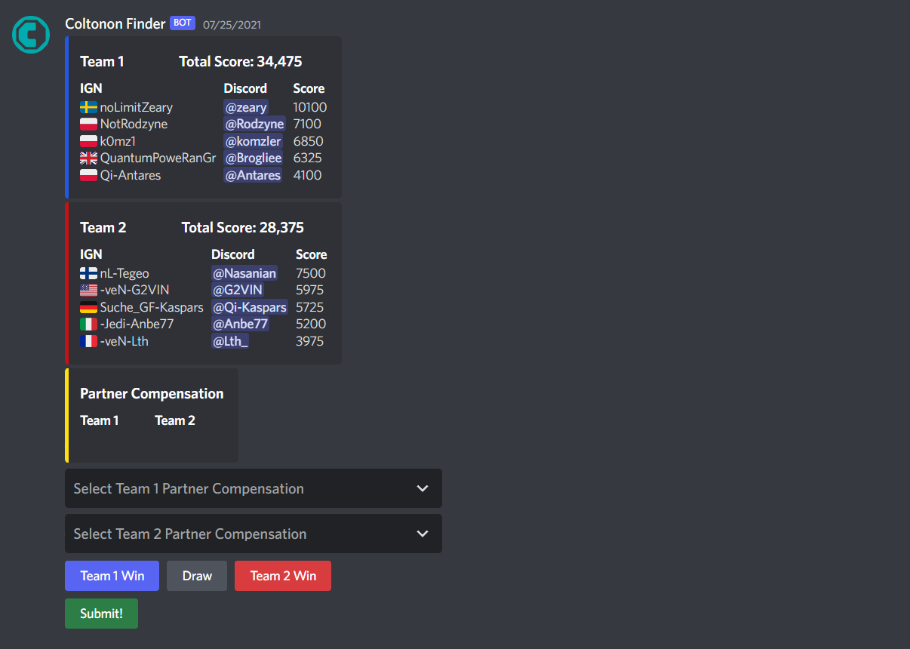
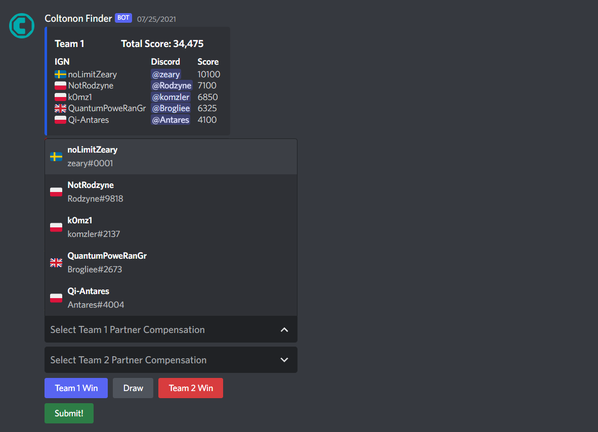
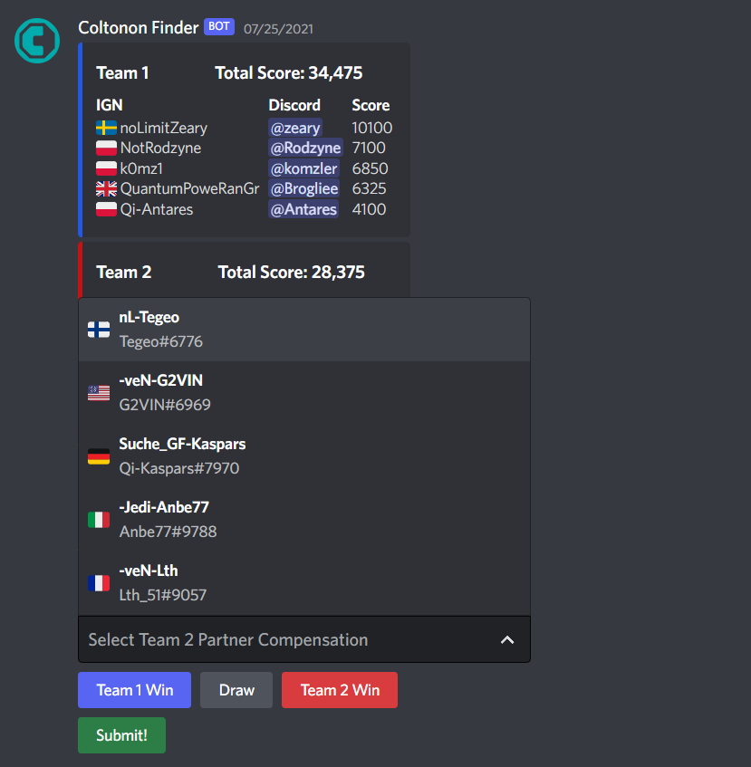
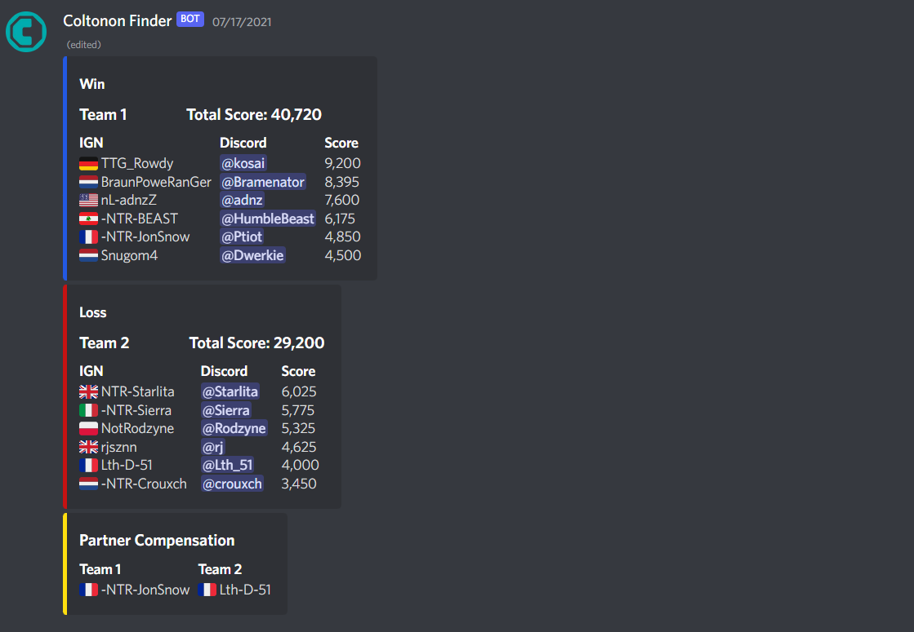
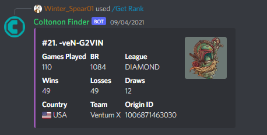
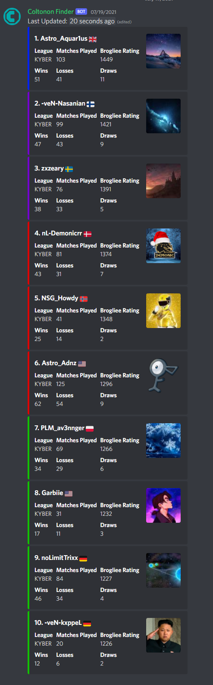
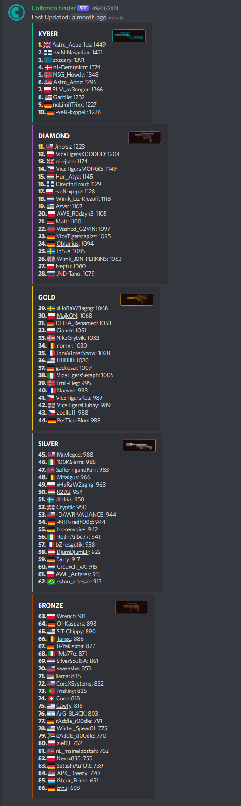

# StarWarsBattlefront2015Rankings

# Origin IDs

## Get Name From ID

## Get ID From Name

## Search

## Balance PUGs From BR

Buttons become disabled once PUG starts or is full

# ScoreBoards

## OCR API + Discord API + Origin API + Google Sheets API

1. Gather data from screenshot with OCR
2. Get Origin IDs of all players
3. Match them with their Discord IDs
4. Display the scoreboard in Discord
5. Accept input in Disord for game outcome and no partner compensation
6. Update Google Sheets accordingly

### Sent Scoreboard

### Initial Response

### Choose Partner Compensation For Each Team

# Final Result

## Ranking

## Top 10

## Leaderboards

### Disclaimer

I added these screenshots as an afterthought so not all are of the same match, I just thought it would be nice to document a little of what I have done for those interested.
